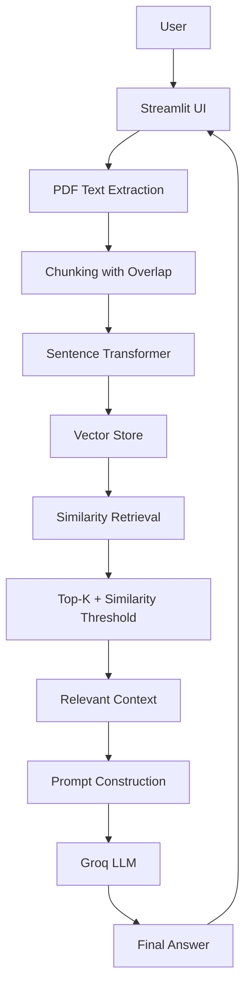

# DocMind-AI

> A Retrieval-Augmented Generation (RAG) application that lets you upload PDF documents and ask natural-language questions about their content.
>
> ---
## Live Demo
https://docmind-ai-ldrjrqgkyrdneknzgsw6kp.streamlit.app/

---

## Overview

DocMind-AI is an AI-powered document question-answering system built on a Retrieval-Augmented Generation (RAG) architecture. It lets you interact with lengthy PDFs without manually searching through every page.

With DocMind-AI you can:

- Upload one or more PDF documents
- Extract text while retaining page information
- Split documents into overlapping chunks
- Convert chunks into semantic embeddings
- Retrieve the most relevant chunks via similarity search
- Filter out weak matches using a similarity threshold
- Generate answers grounded in the uploaded documents, via a Groq-hosted LLM
- View retrieved sources, page numbers, and similarity scores
- Continue the conversation using chat history

---

## Features

| Feature | Description |
|---|---|
| Multiple PDF uploads | Process one or more PDFs in a single session |
| Page-aware extraction | Text is extracted with page numbers preserved for traceability |
| Overlapping chunking | Large documents are split into overlapping chunks for better retrieval |
| Semantic embeddings | Chunks are embedded using a Sentence Transformer model |
| Similarity-based retrieval | Finds the most relevant chunks for a given question |
| Top-K retrieval | Only the highest-ranking chunks are used as context |
| Similarity threshold | Filters out low-relevance chunks before they reach the LLM |
| Chat history | Keeps prior Q&A in the Streamlit session |
| Source visibility | Shows retrieved chunks with page numbers and similarity scores |
| Error handling | Gracefully handles missing API keys, invalid/unreadable PDFs, and low-context questions |

---

## What is RAG?

A traditional LLM answers from what it learned during training — it has no built-in knowledge of a PDF you just uploaded. RAG solves this by combining retrieval with generation: instead of asking the model to answer directly, DocMind-AI first searches your documents for relevant content, then gives that content to the model as context.

**Without RAG:**
```
User Question → LLM → Answer
```
The model has no access to your document.

**With RAG:**
```
User Question → Retrieve relevant content → Retrieved Context → LLM → Grounded Answer
```

---

## How It Works

```
PDF Upload
   ↓
Text Extraction
   ↓
Chunking with Overlap
   ↓
Sentence Transformer Embeddings
   ↓
Vector Store
   ↓
Similarity Search
   ↓
Top-K Retrieval + Similarity Threshold
   ↓
Relevant Context
   ↓
Prompt Construction
   ↓
Groq LLM (Llama 3.3 70B)
   ↓
Final Answer
```



---

## Tech Stack

| Technology | Purpose |
|---|---|
| Python | Core programming language |
| Streamlit | Web interface and application flow |
| PyPDF2 | PDF text extraction |
| Sentence Transformers | Semantic text embeddings |
| Cosine Similarity | Vector similarity search |
| Groq API | LLM inference |
| Llama 3.3 70B | Language model for answer generation |
| NumPy | Numerical / vector operations |
| python-dotenv | Environment variable management |

---

## Getting Started

### Prerequisites

- Python 3.10+
- A Groq API key (https://console.groq.com/)

### Installation

```bash
# Clone the repository
git clone https://github.com/<your-username>/DocMind-AI.git
cd DocMind-AI

# Install dependencies
pip install -r requirements.txt
```

### Configuration

Create a `.env` file in the project root:

```env
GROQ_API_KEY=your_groq_api_key
```

Make sure `.env` is git-ignored:

```gitignore
.env
__pycache__/
*.pyc
```

### Run the app

```bash
streamlit run app.py
```

The app will be available at `http://localhost:8501`.

---

## Project Structure

```
DocMind-AI/
│
├── app.py            # Streamlit UI and app orchestration
├── pdf_reader.py      # PDF text extraction (page-aware)
├── chunking.py        # Overlapping text chunking
├── embeddings.py       # Sentence Transformer embeddings
├── vector_store.py     # Embedding storage + similarity search
├── retriever.py        # Retrieval logic (Top-K, threshold)
├── qa.py               # Prompt construction + Groq LLM call
├── config.py            # App configuration (chunk size, Top-K, etc.)
├── .env                 # API keys (not committed)
├── requirements.txt
└── README.md
```

### File responsibilities

- `app.py` — Builds the UI, handles uploads and questions, wires together the RAG pipeline, maintains chat history, and displays answers with sources.
- `pdf_reader.py` — Converts uploaded PDFs into text while preserving page numbers for traceability.
- `chunking.py` — Splits extracted text into overlapping chunks so information near chunk boundaries isn't lost.
- `embeddings.py` — Generates semantic vector embeddings for each chunk using Sentence Transformers.
- `vector_store.py` — Stores chunk embeddings and performs similarity search against the question embedding.
- `retriever.py` — Runs the retrieval stage: similarity search, Top-K selection, similarity threshold filtering.
- `qa.py` — Builds the final prompt (question + retrieved context) and calls the Groq LLM to generate a grounded answer.
- `config.py` — Centralizes tunable settings like chunk size, overlap, Top-K, and API configuration.

---

## How Retrieval Works

Each document chunk is embedded into vector space. When you ask a question, it's embedded the same way, then compared against every chunk:

```
Question Embedding
     ↓
Compare with document embeddings
     ↓
Calculate similarity (cosine)
     ↓
Rank chunks
     ↓
Select Top-K
     ↓
Apply similarity threshold
     ↓
Relevant Context
```

Because this compares meaning rather than exact words, DocMind-AI can retrieve relevant passages even when your question is phrased differently from the source text.

### Top-K vs. similarity threshold

- Top-K controls how many of the highest-ranked chunks are considered (e.g. the top 3).
- Similarity threshold discards chunks below a minimum relevance score, regardless of rank.

Using both together balances retrieval coverage with relevance.

---

## Generating the Final Answer

The LLM never sees the raw question alone — it receives the question plus the retrieved context:

```
Retrieved Context + User Question
     ↓
Prompt
     ↓
Groq API → Llama 3.3 70B
     ↓
Final Answer
```

This keeps answers grounded in the uploaded documents, and the app is designed to handle cases where no sufficiently relevant context is found.

---

## Error Handling

DocMind-AI handles common failure cases gracefully, including:

- Missing or invalid API keys
- Invalid or corrupted PDF files
- PDFs with no extractable text
- Questions with insufficient relevant context in the uploaded documents

