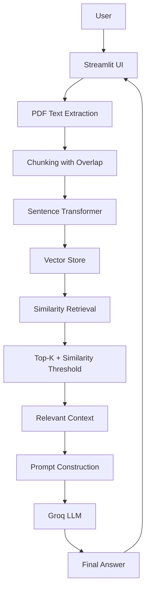

# DocMind-AI

> A Retrieval-Augmented Generation (RAG) application that lets users upload PDF documents and ask natural-language questions about their content.

---

## Project Overview

**DocuRAG** is an AI-powered document question-answering system built using the **Retrieval-Augmented Generation (RAG)** architecture.

The application allows users to:

* Upload one or more PDF documents
* Extract text while retaining page information
* Split documents into overlapping chunks
* Convert chunks into semantic embeddings
* Retrieve the most relevant chunks using similarity search
* Filter weak matches using a similarity threshold
* Provide the retrieved context to a Groq-hosted LLM
* Generate answers grounded in the uploaded documents
* View retrieved sources, page numbers, and similarity scores
* Continue conversations using chat history

The goal is to make it easier to interact with lengthy documents without manually searching through every page.

---

## Live Demo
https://docmind-ai-ldrjrqgkyrdneknzgsw6kp.streamlit.app/

---

#  Features

###  Multiple PDF Uploads

Upload one or more PDF documents and process their content for question answering.

###  Page-Aware Text Extraction

Text is extracted from PDFs while preserving page information so retrieved answers can be traced back to their source pages.

###  Overlapping Chunking

Large documents are divided into smaller overlapping text chunks to make retrieval more effective.

###  Semantic Embeddings

Each document chunk is converted into a numerical vector using a **Sentence Transformer** model.

###  Similarity-Based Retrieval

The system compares the user's question with document chunks and retrieves the most relevant content.

### Top-K Retrieval

Only the highest-ranking chunks are selected as potential context for the LLM.

### Similarity Threshold

Low-relevance chunks can be filtered out using a similarity threshold, reducing the chance of generating answers from unrelated document content.

### Grounded Question Answering

The LLM receives the retrieved document context and generates an answer based on that context.

### Chat History

Previous questions and answers are maintained within the Streamlit session.

### Source Visibility

Retrieved chunks can be displayed along with their page numbers and similarity scores.

### Error Handling

The application handles situations such as:

* Missing API keys
* Invalid PDF files
* PDFs without extractable text
* Questions with insufficient relevant context

---

# What is RAG?

**RAG stands for Retrieval-Augmented Generation.**

A traditional LLM generates an answer primarily from the knowledge it learned during training. However, it does not automatically know the contents of a PDF that a user uploads.

RAG solves this by combining:

```text
Retrieval + Generation
```

Instead of asking the LLM to answer directly, DocuRAG first searches the uploaded documents for relevant information.

### Without RAG

```text
User Question
      ↓
     LLM
      ↓
   Answer
```

The model may not have access to the user's document.

### With RAG

```text
User Question
      ↓
Find relevant document content
      ↓
Retrieved Context
      ↓
     LLM
      ↓
Grounded Answer
```

This allows the model to use information retrieved from the user's documents when generating its response.

---

# How DocuRAG Works

The complete workflow is:

```text
PDF Upload
     ↓
Text Extraction
     ↓
Chunking with Overlap
     ↓
Sentence Transformer Embeddings
     ↓
Vector Store
     ↓
Similarity Search
     ↓
Top-K Retrieval
     ↓
Similarity Threshold
     ↓
Relevant Context
     ↓
Prompt Construction
     ↓
Groq LLM
     ↓
Final Answer
```

---

# RAG Architecture



---

# Tech Stack

| Technology                    | Purpose                              |
| ----------------------------- | ------------------------------------ |
| **Python**                    | Core programming language            |
| **Streamlit**                 | Web interface and application flow   |
| **PyPDF2**                    | PDF text extraction                  |
| **Sentence Transformers**     | Semantic text embeddings             |
| **Cosine Similarity**         | Vector similarity search             |
| **Groq API**                  | LLM inference                        |
| **Llama 3.3 70B**             | Language model for answer generation |
| **NumPy**                     | Numerical/vector operations          |
| **python-dotenv**             | Environment variable management      |

---

# Project Structure

```text
DocuRAG/
│
├── app.py
├── pdf_reader.py
├── chunking.py
├── embeddings.py
├── vector_store.py
├── retriever.py
├── qa.py
├── config.py
├── .env
├── requirements.txt
└── README.md
```

---

# Detailed File Explanation

## `app.py`

The main Streamlit application.

Responsible for:

* Building the user interface
* Accepting PDF uploads
* Accepting user questions
* Connecting the different RAG components
* Maintaining chat history
* Displaying answers and retrieved sources

---

## `pdf_reader.py`

Handles PDF text extraction.

Its main responsibility is converting uploaded PDF files into usable text while retaining page-level information.

Conceptually:

```text
PDF
 ↓
Pages
 ↓
Extracted Text + Page Number
```

Keeping page numbers allows the application to identify where retrieved information came from.

---

## `chunking.py`

Splits extracted document text into smaller pieces called **chunks**.

Large documents cannot be treated as one enormous piece of text during retrieval. Chunking creates manageable units that can individually be embedded and searched.

The chunks use overlap so that important information near a chunk boundary is less likely to be separated from its surrounding context.

Example:

```text
Chunk 1:
A B C D E F G

Chunk 2:
        F G H I J K L
        ↑
      overlap
```

---

## `embeddings.py`

Generates semantic embeddings using **Sentence Transformers**.

An embedding converts text into a numerical vector representation.

For example:

```text
"Machine learning is a subset of AI"
                 ↓
        [0.12, -0.34, 0.78, ...]
```

Texts with similar meanings tend to have vectors that are closer together in embedding space.

This allows the system to perform **semantic retrieval**, rather than relying only on exact keyword matches.

---

## `vector_store.py`

Responsible for storing document embeddings and performing similarity-based searches.

Conceptually:

```text
Document Chunks
      ↓
 Embedding Vectors
      ↓
  Vector Store
      ↓
Similarity Search
```

The vector store allows the application to efficiently identify chunks that are mathematically similar to the question embedding.

---

## `retriever.py`

Controls the retrieval stage of the RAG pipeline.

It:

1. Receives the user's question
2. Converts/searches against its representation
3. Performs similarity search
4. Selects the Top-K results
5. Applies the similarity threshold
6. Returns relevant document chunks

The similarity threshold helps prevent weakly related chunks from being passed to the LLM.

---

## `qa.py`

Handles the generation stage.

It builds a prompt containing:

```text
User Question
      +
Retrieved Document Context
      ↓
Groq LLM
      ↓
Generated Answer
```

The prompt instructs the model to answer using the retrieved document context rather than freely relying on unrelated external knowledge.

---

## `config.py`

Contains application configuration values such as:

* Chunk size
* Chunk overlap
* Top-K value
* API configuration

Keeping configuration separate makes the application easier to maintain and tune.

---

## `.env`

Stores sensitive configuration such as API keys.

Example:

```env
GROQ_API_KEY=your_groq_api_key
```
Add `.env` to `.gitignore`:

```gitignore
.env
__pycache__/
*.pyc
```

#  How Retrieval Works

Retrieval is one of the most important stages of the RAG pipeline.

Suppose a document has been divided into:

```text
Chunk 1
Chunk 2
Chunk 3
...
Chunk N
```

Each chunk is converted into an embedding.

When the user asks:

```text
"What are the limitations of the proposed approach?"
```

the question is represented in the same embedding space.

The system then compares the question representation with the document chunk representations.

Conceptually:

```text
Question Embedding
        ↓
Compare with document embeddings
        ↓
Calculate similarity
        ↓
Rank chunks
        ↓
Select Top-K
        ↓
Apply similarity threshold
        ↓
Relevant Context
```

This allows the system to retrieve content based on **meaning**, not just exact word matching.

---

# How Embeddings Work

An embedding represents text as a vector of numbers.

For example:

```text
"Deep learning uses neural networks"
                    ↓
       [0.21, -0.08, 0.64, ...]
```

A Sentence Transformer generates these vectors based on the semantic meaning of the text.

Consider:

```text
Text A:
"How does machine learning work?"

Text B:
"What is the process behind machine learning?"
```

Although the wording is different, their meanings are similar.

Their embeddings should therefore be relatively close in vector space.

This is why embeddings are useful for semantic document retrieval.

---

# How Similarity Search Works

After generating embeddings, the system needs a way to determine which document chunks are most relevant to a question.

A common approach is **cosine similarity**.

Conceptually:

```text
                    Question
                       ↓
                Question Vector
                       ↓
          ┌────────────┼────────────┐
          ↓            ↓            ↓
       Chunk 1      Chunk 2      Chunk 3
       Vector       Vector       Vector
          ↓            ↓            ↓
       Similarity   Similarity   Similarity
          ↓            ↓            ↓
             Rank Results
                  ↓
               Top-K
```

A higher similarity score generally indicates that two vectors point in more similar directions.

The retriever then uses the highest-scoring chunks as candidate context.

---

# Why Top-K and Similarity Threshold?

Two retrieval controls are used:

### Top-K

Top-K determines how many of the highest-ranked chunks are selected.

For example:

```text
Top-K = 3
```

means the system considers the three highest-ranked chunks.

### Similarity Threshold

A similarity threshold removes results that are not sufficiently relevant.

Conceptually:

```text
Similarity Score
       ↓
Is score >= threshold?
       ↓
   Yes       No
    ↓         ↓
Keep       Discard
```

Using both mechanisms helps balance **retrieval coverage** and **relevance**.

---

#  How the LLM Generates the Final Answer

The LLM does not simply receive the user's question.

It receives a prompt containing the retrieved document context.

Conceptually:

```text
Retrieved Context
       +
User Question
       ↓
Prompt
       ↓
Groq API
       ↓
Llama 3.3 70B
       ↓
Final Answer
```

The retrieved context gives the model relevant information from the uploaded documents.

This is the **Generation** part of Retrieval-Augmented Generation.

The application is designed to keep the answer grounded in retrieved document context and handle cases where the requested information is not present.

---
